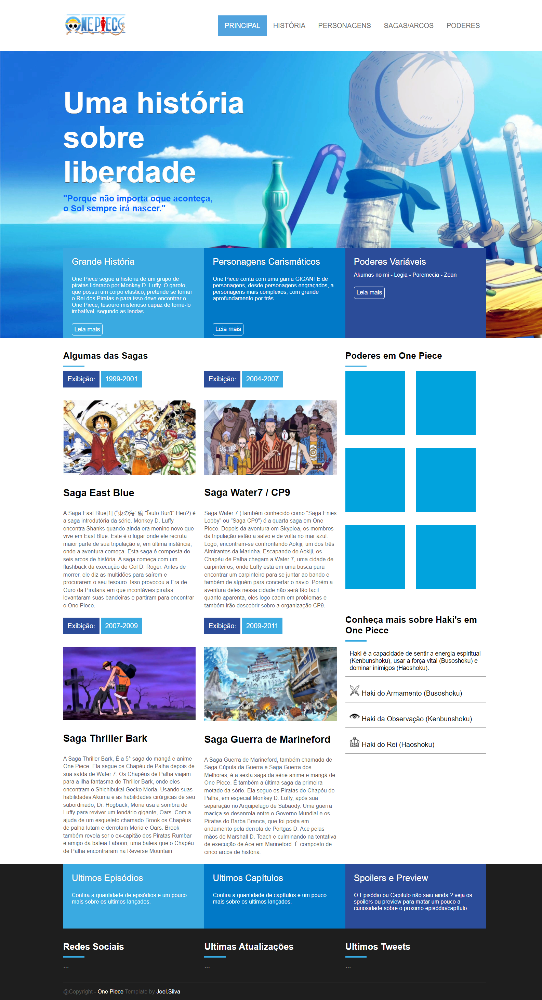

# Olá, meu nome é **Joel** e esse é um dos meus projetos! 👋
Esse projeto foi feito para por em prática todo o conhecimento adquirido após ter feito um curso de HTML/CSS pela B7WEB, e principalmente para por em prática todo o conceito de Flexbox.

 
O assunto poderia ser qualquer um, fiz sobre One Piece por ser uma obra que eu gosto bastante e o resultado no final ficou bem bonito, melhor até do que eu esperava.

 

**O resultado pode ser visto logo abaixo também:**
 

 

**Ou entrando pelo link também para melhor visualização:**
<a target="blank" href="https://joeljsilva.github.io/projeto-b7web/">https://joeljsilva.github.io/projeto-b7web/</a>

 

## Meu Linkedin

 - 
